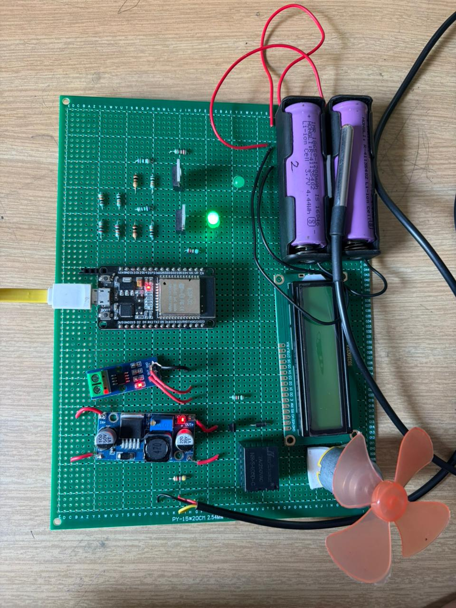
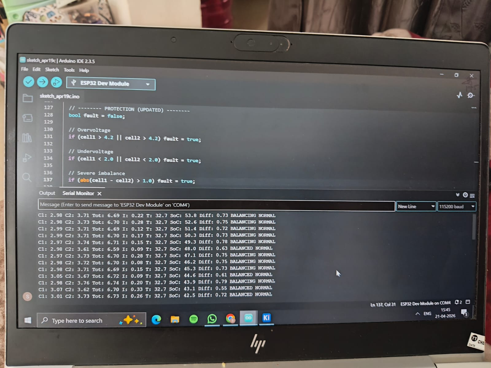

# Smart Battery Management System (BMS) with Cell Balancing using ESP32

## Project Overview

This project presents a Smart Battery Management System (BMS) developed using ESP32 for monitoring, protection, and passive cell balancing of a 2S lithium-ion battery pack.

The system monitors battery voltage, individual cell voltages, current, temperature, and State of Charge (SoC) in real time. It also provides protection against abnormal battery conditions and uses MOSFET-based passive cell balancing.

Wi-Fi connectivity is used to send battery data to ThingSpeak for IoT-based remote monitoring.
## Project Prototype

### Hardware Prototype

### Serial Monitor Output

